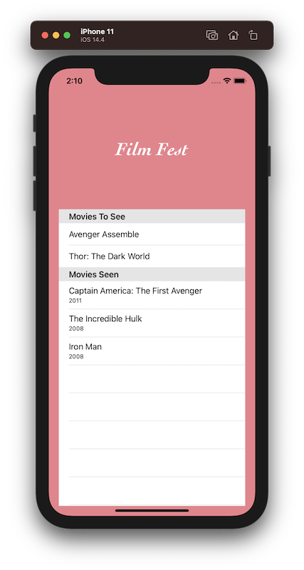

#  iOS App Development: Test-Driven Development (Linkedin Course)

## Objectives

* What is test-driven development?
* Creating and expanding a data model
* Creating a manager class
* Testing class methods
* Checking for duplicates
* Testing table views
* Mocking cells
* Testing cell selection
* Assembling the app

## Screenshoot

>This is a companion project to The iOS App Development: Test-Driven Development, check out the full course at [linkedin iOS App Development: Test-Driven Development](https://www.linkedin.com/learning/ios-app-development-test-driven-development-2/next-steps)

